# Machine Learning Engineer Nanodegree
## Capstone Project


Ishan Soni </br> 
December 26th, 2018

## I. Definition

### **Project Overview**

My project draws upon the domain of document classification with an emphasis on the natural language processing component of document classification. Machine learning has been successfully used to classify documents by topic for several decades. However, machine learning techniques do not perform as well when performing sentiment analysis which requires the parsing of more complex language structures. This is where ideas from natural language processing must be applied.
My aim with this project is to make progress towards solving a complex natural language processing problem using machine learning. I think that it would be very beneficial if computers could interpret and produce the same kind of natural language of which even young children are capable. This would allow machine learning to be applied to a wider variety of tasks than it is currently capable of solving. In particular, machine learning could be applied to many problems that are not well structured and for which there is not much training data.

This capstone project is based on the [Toxic Comment Classification Challenge](https://www.kaggle.com/c/jigsaw-toxic-comment-classification-challenge)

Discussing things you care about can be difficult. The threat of abuse and harassment online means that many people stop expressing themselves and give up on seeking different opinions. Platforms struggle to effectively facilitate conversations, leading many communities to limit or completely shut down user comments.

The Conversation AI team, a research initiative founded by Jigsaw and Google (both a part of Alphabet) are working on tools to help improve online conversation. One area of focus is the study of negative online behaviors, like toxic comments (i.e. comments that are rude, disrespectful or otherwise likely to make someone leave a discussion). So far they’ve built a range of publicly available models served through the Perspective API, including toxicity. But the current models still make errors, and they don’t allow users to select which types of toxicity they’re interested in finding (e.g. some platforms may be fine with profanity, but not with other types of toxic content).

With more people joining social media than ever before, it becomes imperative that this problem is solved. Classifying toxic comments (obscene, threat, insult, identity-based hate) will be the core of this project.

</br></br></br>
### **Problem Statement**

In this project, I will build a multi-headed model that will be capable of detecting different types of toxicity like threats, obscenity, insults, and identity-based hate from a given comment. I’ll be using a dataset of comments from Wikipedia’s talk page edits which have been labeled by human raters for toxic behavior. Improvements to the current models will hopefully help online discussion become more productive and respectful.

This is a supervised multi-class classification problem and as such different measurable evaluation metrics could be applied. I'll be using the AUC-ROC metric to measure the efficiency of my models. Given a comment, the solution will be a machine learning model that receives as input the comment and outputs a class probabilty for every toxicity type [_toxicity_type_] : toxic, severe_toxic, obscene, threat, insult, identity_hate.

<u>Example 1</u></br>
Input Text : _You, sir, are my hero!_</br>
Output will be : toxic : 0.1 , obscence : 0.0, ..</br>
The output states that the algorithm thinks that there is a 0.1 probability or 10% chance that the given text is toxic. 
Similarly the algorithm thinks that there is 0 probability or 0% chance that this text is obscene.

<u>Example 2</u></br>
Input Text : _Oh my, you are so fuckable!_</br>
Output will be : toxic : 0.1 , obscence : 0.8, ..</br>
The output states that the algorithm thinks that there is a 0.1 probability or 10% chance that the given text is toxic. 
Similarly the algorithm thinks that there is 0.8 probability or 80% chance that this text is obscene. These class probabilities will enable us to make many smart decisions. Such a comment should be fine on a platform that tolerates obscenity. Such platforms can use this class probability and mark this post as _NSFW_. Other platforms that don't tolerate obscenity can choose to delete such comments automatically.

Generally, if the class probability for a particular type of toxicity is > 0.5, we will label it as a toxic comment with that toxicity type.


### **Metrics**

There are many different metrics that could be used to evaluate the solution, given that this is a multi-class classification problem. The most common metric is accuracy. We can create a confusion matrix for each toxicity type and study the algorithm's accuracy for that toxicity type. 

Generally, if the class probability for a particular type of toxicity is > 0.5, we can label it as a toxic comment with that toxicity type. Therefore we can easily build a confusion matrix for each toxicity class.

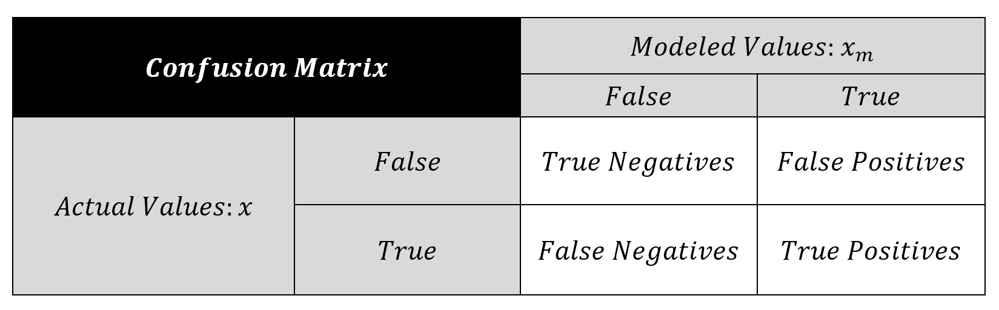

But since we are more interested in probabilities and we have defined our solution as : _Given a comment, the solution will be a machine learning model that receives as input the comment and outputs a class probabilty for every toxicity type_, an evaluation metric like the **AUC - ROC Curve (Area Under the Receiver Operating Characteristics)** makes more sense. AUC - ROC curve is a performance measurement for classification problems at various thresholds settings. ROC (Receiver Operating Characteristics) is a probability curve and its AUC(Area Under Curve) represents the degree or measure of separability. It tells us how much a given model is capable of distinguishing between classes. Higher the AUC, better the model is at predicting 0s as 0s and 1s as 1s.
The ROC curve is plotted with TPR(True Positive Rate) against the FPR(False Positive Rate) where TPR is on the y-axis and FPR is on the the x-axis.


 


An excellent model has AUC near to 1 which means it has a good measure of separability. A poor model has AUC near to the 0 which means it has worst measure of separability. In fact it means it is reciprocating the result. It is predicting 0s as 1s and 1s as 0s. And when AUC is 0.5, it means our model has no class separation capacity whatsoever.

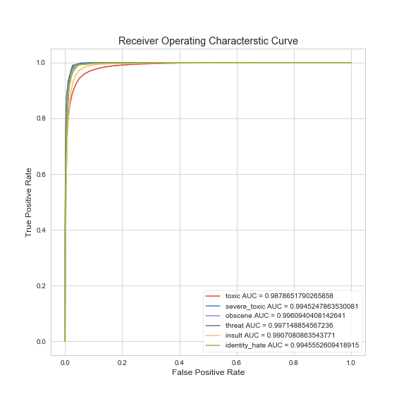

Since our models will output probabilities, the AUC-ROC which is based on probability distributions will prove to be the correct metric. We will be using the AUC-ROC score while we cross validate our models.


## II. Analysis

### **Data Exploration**

I’ll be using a dataset of comments from Wikipedia’s talk page edits which have been labeled by human raters for toxic behavior.

The types of toxicity are:

* toxic
* severe_toxic
* obscene
* threat
* insult
* identity_hate

Both the train and test datasets are in the form of a csv and are stored in the data directory. 
The train dataset has _159571_ observations and the test dataset has _153164_ observations.
Each train observation corresponds to a different comment. There are a total of 8 variables/columns in this dataset and they are described below : </br></br></br>

<table>
    <thead>
        <th>Variable</th>
        <th>Data Type/ Values it can take</th>
        <th>Description</th>
    </thead>
    <tbody>
        <tr>
            <td>id</td>
            <td>object/string</td>
            <td>Unique identifier</td>
        <tr>
        <tr>
            <td>comment_text</td>
            <td>string</td>
            <td>The comment text we need to evaluate</td>
        <tr>
        <tr>
            <td>toxic</td>
            <td>int64/Boolean. The possible values are 0 and 1</td>
            <td>Specifies whether the given comment is toxic or not.</td>
        <tr>
        <tr>
            <td>severe_toxic</td>
            <td>int64/Boolean. The possible values are 0 and 1</td>
            <td>Specifies whether the given comment is severly toxic or not.</td>
        <tr>
        <tr>
            <td>obscene</td>
            <td>int64/Boolean. The possible values are 0 and 1</td>
            <td>Specifies whether the given comment is obscene/vulgar.</td>
        <tr>
        <tr>
            <td>threat</td>
            <td>int64/Boolean. The possible values are 0 and 1</td>
            <td>Specifies whether the given comment is a threat.</td>
        <tr>
        <tr>
            <td>insult</td>
            <td>int64/Boolean. The possible values are 0 and 1</td>
            <td>Specifies whether the given comment is an insult.</td>
        <tr>
        <tr>
            <td>identity_hate</td>
            <td>int64/Boolean. The possible values are 0 and 1</td>
            <td>Specifies whether the given comment is identity hate.</td>
        <tr>
    </tbody>
</table>

The train and test dataset _do not_ contain any null values. </br>

Sample Data : </br>
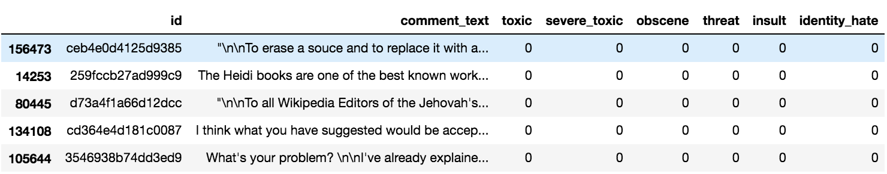

The distribution of different toxicity types are as follows : </br>
<table>
    <thead>
        <th>Class/Toxicity Type</th>
        <th>Percentage (%)</th>
    </thead>
    <tbody>
        <tr>
            <td>Clean</td>
            <td>80.3</td>
        </tr>
        <tr>
            <td>Toxic</td>
            <td>8.6</td>
        </tr>
        <tr>
            <td>Severe Toxic</td>
            <td>0.9</td>
        </tr>
        <tr>
            <td>Obscene</td>
            <td>4.7</td>
        </tr>
        <tr>
            <td>Threat</td>
            <td>0.3</td>
        </tr>
        <tr>
            <td>Insult</td>
            <td>4.4</td>
        </tr>
        <tr>
            <td>Identity hate</td>
            <td>0.8</td>
        </tr>
    </tbody>
</table>


### **Exploratory Visualization**

The below images shows the distribution of toxicity type in our train dataset.

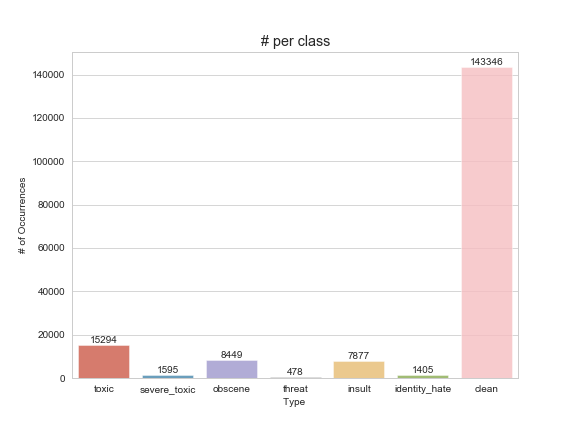 
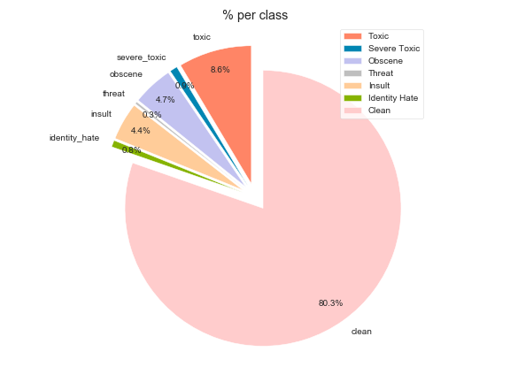

The above figures support our decision of building a multiheaded classification model. The distribution of toxicity types is very uneven. The toxicity is not evenly spread out across classes. Hence we might face class imbalance problems. </br>

_Lets look at some common words for different toxicity types_

1. <u>Common words in clean comments</u> :
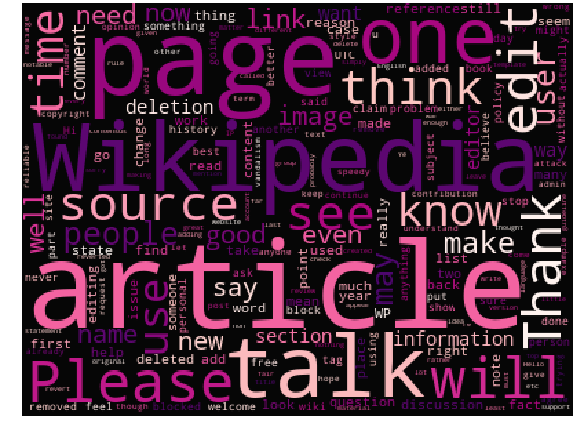

2. <u>Common words in toxic comments</u> :
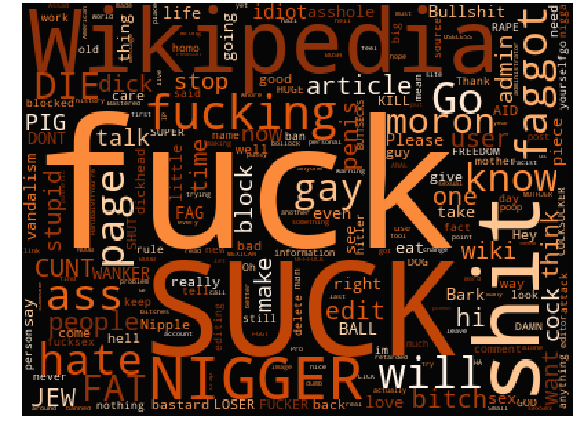

3. <u>Common words in severe toxic comments</u> :
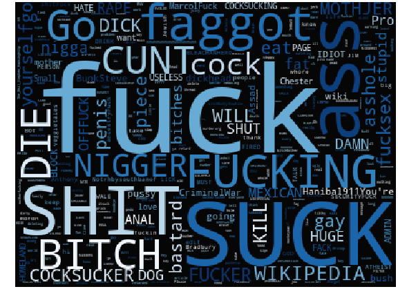

4. <u>Common words in obscene comments</u> :
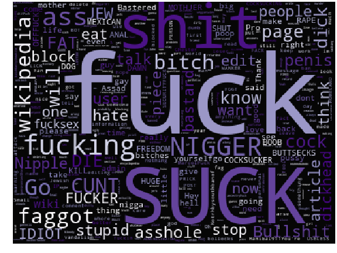

5. <u>Common words in threat comments</u> :
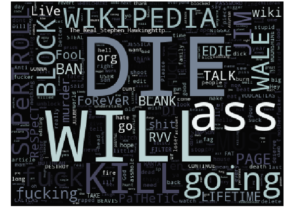

6. <u>Common words in insult commnents</u> :
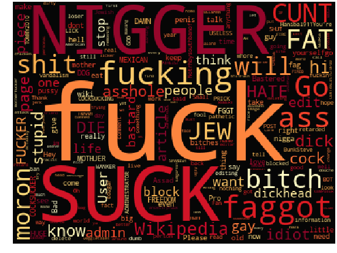

7. <u>Common words in identity hate comments</u> :
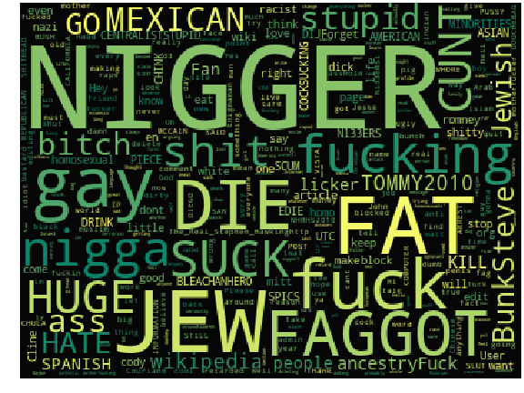

From the above visualizations, we can see the most common words for each toxicity type. Since this dataset is taken from wikipedia talk's page edits, we can see that wikipedia is a common term in all toxicity types and can be removed since it doesn't help us at all in our analysis. Also, we can see a few usernames in the words too. We should also clean them.


### **Algorithms and Techniques**

Since we have defined our solution as : _Given a comment, the solution will be a machine learning model that receives as input the comment and outputs a class probabilty for every toxicity type_, I will use machine learning algorithms that can output probabilities. I will be employing two algorithms to solve the problem : linear models and MultinomialNB (Naive Bayes classifier for multinomial models).

The linear logistic regression will form my benchmark. I will also use it for my actual model. Linear logistic regression is a good benchmark because it is simple and does not require the tuning of many hyperparameters. It is also fast to train and robust to noisy data. The expectation is that the more complex Logistic Regression model (after hyperparameter optimization and feature transformations) and MultinomialNB model should achieve superior performances.

Naive Bayes is a family of algorithms based on applying Bayes theorem with a strong(naive) assumption, that every feature is independent of the others, in order to predict the category of a given sample. They are probabilistic classifiers, therefore will calculate the probability of each category using Bayes theorem. The multinomial Naive Bayes classifier is suitable for classification with discrete features (e.g., word counts for text classification). The multinomial distribution normally requires integer feature counts. However, in practice, fractional counts such as tf-idf may also work. We do have other alternatives when coping with NLP problems, such as Support Vector Machine (SVM) and neural networks. However, the simple design of Naive Bayes classifiers make them very attractive for such classifiers. Moreover, they have been demonstrated to be fast, reliable and accurate in a number of applications of NLP.


### **Benchmark**

The linear logistic regression (LogisticRegression) from the sklearn.linear_model package will form my benchmark. Linear logistic regression is a good benchmark because it is simple and does not require the tuning of many hyperparameters. It is also fast to train and robust to noisy data. 

This benchmark model is trained on a Bag of Words representation of our data. 

The Bag Of Word representation was created during the sklearn.feature_extraction.text.CountVectorizer. It was instantiated using the following parameters

| Argument     | Value  | Explanation                                                 |
|--------------|--------|-------------------------------------------------------------|
| min_df       | 5      | Only retain terms that appear in atleast 5 comments         |
| ngram_range  | (1, 1) | Create ngrams of 1 word each                                |
| max_features | 10000  | Only include the top 10000 terms ordered by term frequency. |

We train this model on our bag of words representation and use cross validation to ensure our model is not overfit. The average cross-validated AUC-ROC score we get for this benchmark model on our train data is around **0.94**. This benchmark model gives us a Kaggle score of **0.9376**.


## III. Methodology

### **Data Preprocessing**

Before we predict probabilities for each toxicity class using our machine learning algorithms, we need to convert our raw comment text into a form that can be consumed by these algorithms. Below are the two vectorized forms I have used :

1. Bag of Words : In this model, a text (such as a sentence or a document) is represented as the bag (multiset) of its words, where the (frequency of) occurrence of each word is used as a feature for training a classifier. [Bag-of-words](https://en.wikipedia.org/wiki/Bag-of-words_model)

2. Tfidf : TFIDF, short for term frequency–inverse document frequency, is a numerical statistic that is intended to reflect how important a word is to a document in a collection or corpus.
[Tf-idf](https://en.wikipedia.org/wiki/Tf%E2%80%93idf)

Both of these vectorized representations are very sparse matrices. Therefore we need to reduce the number of features we have in these representations by reducing our vocabulary. We do this by removing words that are not relevant and by converting different words that convey the same meaning into the single same word. 

As identified during Data Exploration, there were a lot of / n's and a lot of usernames in our comment text. We have removed these unnecessary words during our Data Cleaning phase.</br></br></br></br>

```python
train['comment_text'] = train['comment_text'].map(lambda x: re.sub('\\n',' ',str(x)))

train['comment_text'] = train['comment_text'].map(lambda x: re.sub("\[\[User.*",'',str(x)))
```

After this, we removed _stopwords_ from our comment text and performed _stemming_.
_Stopwords_ are words like 'a', 'the', 'in' etc that occur very frequently in our data but do not contribute anything towards our analysis. 
_Stemming_ is the process of reducing inflected (or sometimes derived) words to their word stem, base or root form. Eg love, loved and loving mean the same thing and performing a stem operation on them will reduce all of them into the same root form 'lov'. This will further reduce our vocab and reduce the matrix sparsity of our bag of words/ ngrams representations.

The following function was used to remove stopwords and perform stemming :

```python
import string
from nltk.corpus import stopwords
from nltk.tokenize import word_tokenize

# Stemmer
from nltk.stem import SnowballStemmer
s = SnowballStemmer("english")

def cleanComment(comment):
    comment = comment.translate(str.maketrans('', '', string.punctuation))
    words = [s.stem(w.lower()) for w in word_tokenize(comment) if w.lower() not in stopwords.words("english")]
    return " ".join(words)
```


### **Implementation**

In this section, the process for which metrics, algorithms, and techniques that you implemented for the given data will need to be clearly documented. It should be abundantly clear how the implementation was carried out, and discussion should be made regarding any complications that occurred during this process. Questions to ask yourself when writing this section:
- _Is it made clear how the algorithms and techniques were implemented with the given datasets or input data?_
- _Were there any complications with the original metrics or techniques that required changing prior to acquiring a solution?_
- _Was there any part of the coding process (e.g., writing complicated functions) that should be documented?_

### Refinement
In this section, you will need to discuss the process of improvement you made upon the algorithms and techniques you used in your implementation. For example, adjusting parameters for certain models to acquire improved solutions would fall under the refinement category. Your initial and final solutions should be reported, as well as any significant intermediate results as necessary. Questions to ask yourself when writing this section:
- _Has an initial solution been found and clearly reported?_
- _Is the process of improvement clearly documented, such as what techniques were used?_
- _Are intermediate and final solutions clearly reported as the process is improved?_


## IV. Results
_(approx. 2-3 pages)_

### Model Evaluation and Validation
In this section, the final model and any supporting qualities should be evaluated in detail. It should be clear how the final model was derived and why this model was chosen. In addition, some type of analysis should be used to validate the robustness of this model and its solution, such as manipulating the input data or environment to see how the model’s solution is affected (this is called sensitivity analysis). Questions to ask yourself when writing this section:
- _Is the final model reasonable and aligning with solution expectations? Are the final parameters of the model appropriate?_
- _Has the final model been tested with various inputs to evaluate whether the model generalizes well to unseen data?_
- _Is the model robust enough for the problem? Do small perturbations (changes) in training data or the input space greatly affect the results?_
- _Can results found from the model be trusted?_

### Justification
In this section, your model’s final solution and its results should be compared to the benchmark you established earlier in the project using some type of statistical analysis. You should also justify whether these results and the solution are significant enough to have solved the problem posed in the project. Questions to ask yourself when writing this section:
- _Are the final results found stronger than the benchmark result reported earlier?_
- _Have you thoroughly analyzed and discussed the final solution?_
- _Is the final solution significant enough to have solved the problem?_


## V. Conclusion
_(approx. 1-2 pages)_

### Free-Form Visualization
In this section, you will need to provide some form of visualization that emphasizes an important quality about the project. It is much more free-form, but should reasonably support a significant result or characteristic about the problem that you want to discuss. Questions to ask yourself when writing this section:
- _Have you visualized a relevant or important quality about the problem, dataset, input data, or results?_
- _Is the visualization thoroughly analyzed and discussed?_
- _If a plot is provided, are the axes, title, and datum clearly defined?_

### Reflection
In this section, you will summarize the entire end-to-end problem solution and discuss one or two particular aspects of the project you found interesting or difficult. You are expected to reflect on the project as a whole to show that you have a firm understanding of the entire process employed in your work. Questions to ask yourself when writing this section:
- _Have you thoroughly summarized the entire process you used for this project?_
- _Were there any interesting aspects of the project?_
- _Were there any difficult aspects of the project?_
- _Does the final model and solution fit your expectations for the problem, and should it be used in a general setting to solve these types of problems?_

### Improvement
In this section, you will need to provide discussion as to how one aspect of the implementation you designed could be improved. As an example, consider ways your implementation can be made more general, and what would need to be modified. You do not need to make this improvement, but the potential solutions resulting from these changes are considered and compared/contrasted to your current solution. Questions to ask yourself when writing this section:
- _Are there further improvements that could be made on the algorithms or techniques you used in this project?_
- _Were there algorithms or techniques you researched that you did not know how to implement, but would consider using if you knew how?_
- _If you used your final solution as the new benchmark, do you think an even better solution exists?_

-----------

**Before submitting, ask yourself. . .**

- Does the project report you’ve written follow a well-organized structure similar to that of the project template?
- Is each section (particularly **Analysis** and **Methodology**) written in a clear, concise and specific fashion? Are there any ambiguous terms or phrases that need clarification?
- Would the intended audience of your project be able to understand your analysis, methods, and results?
- Have you properly proof-read your project report to assure there are minimal grammatical and spelling mistakes?
- Are all the resources used for this project correctly cited and referenced?
- Is the code that implements your solution easily readable and properly commented?
- Does the code execute without error and produce results similar to those reported?
